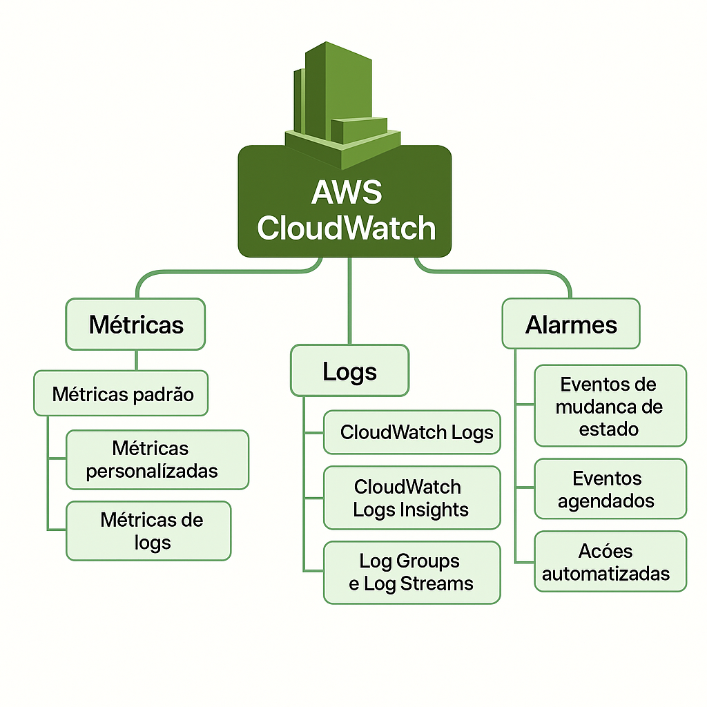

# AWS CloudWatch  

O **Amazon CloudWatch** é o serviço de **monitoramento e observabilidade** da AWS.  
Ele coleta, acompanha e analisa métricas, logs e eventos de praticamente todos os serviços AWS  
(e também de aplicações e servidores on-premises). 

## Principais Recursos  

- **Métricas**: coleta e monitora dados de desempenho de serviços  
  (ex.: uso de CPU em EC2, IOPS em EBS, requisições em API Gateway).  
- **Logs**: centraliza e armazena logs de aplicações e serviços; suporta consultas com **CloudWatch Logs Insights**.  
- **Alarmes**: cria alertas baseados em métricas (ex.: disparar SNS quando CPU > 80%).  
- **Eventos (EventBridge)**: reage a mudanças em serviços AWS ou eventos customizados.  
- **Painéis (Dashboards)**: visualização personalizada de métricas e gráficos.  
- **Análise de Aplicações**: integra com X-Ray e outros para rastreamento e troubleshooting. 

## Exemplos de uso

- Monitorar CPU, memória e disco de instâncias EC2;
- Alertar quando uma função Lambda falha repetidamente;
- Coletar logs de aplicação e criar métricas personalizadas a partir deles;
- Acionar automações via EventBridge quando um evento específico ocorre.

## Benefícios  

- Visibilidade unificada de toda a infraestrutura; 
- Ajuda a detectar e responder rapidamente a falhas;
- Suporta automação (acionando Lambda, ECS, Auto Scaling, etc.);  
- Pode monitorar recursos **on-premises** e **multicloud** além da AWS;
- Centraliza monitoramento de infraestrutura e aplicações;
- Integração com outros serviços AWS, como SNS, Lambda, S3, etc;
- Escalabilidade automática para lidar com grande volume de dados de logs e métricas. 

## Principais Componentes do CloudWatch  

### Tabela Resumida  

| Componente      | Descrição                                                                 |
|-----------------|---------------------------------------------------------------------------|
| Métricas        | Coleta e monitora dados de desempenho dos serviços e aplicações.           |
| Logs            | Centraliza e armazena logs; permite análise com CloudWatch Logs Insights. |
| Alarmes         | Define condições para métricas e aciona ações (SNS, Auto Scaling, etc.).  |
| Eventos         | Detecta mudanças em recursos da AWS (via EventBridge) e dispara respostas.|
| Dashboards      | Visualizações personalizadas de métricas, gráficos e alarmes.             |

---

### Tabela Expandida com Casos de Uso  

| Componente  | Descrição                                                                 | Caso de Uso Prático                                                                 |
|-------------|---------------------------------------------------------------------------|-------------------------------------------------------------------------------------|
| Métricas    | Monitora dados de desempenho dos serviços e aplicações.                   | Escalar automaticamente uma instância EC2 quando o uso de CPU ultrapassar 80%.      |
| Logs        | Centraliza e armazena logs para análise e troubleshooting.                 | Detectar erros de aplicação em tempo real e gerar alertas.                           |
| Alarmes     | Define condições e dispara ações automáticas ou notificações.              | Enviar notificação pelo SNS quando o banco de dados RDS atingir limite de conexões. |
| Eventos     | Reage a mudanças em recursos AWS ou eventos customizados (EventBridge).    | Acionar uma função Lambda ao criar uma nova instância EC2.                           |
| Dashboards  | Visualizações personalizadas de métricas, gráficos e alarmes.             | Criar um painel de monitoramento de múltiplas aplicações em uma única tela.          |
